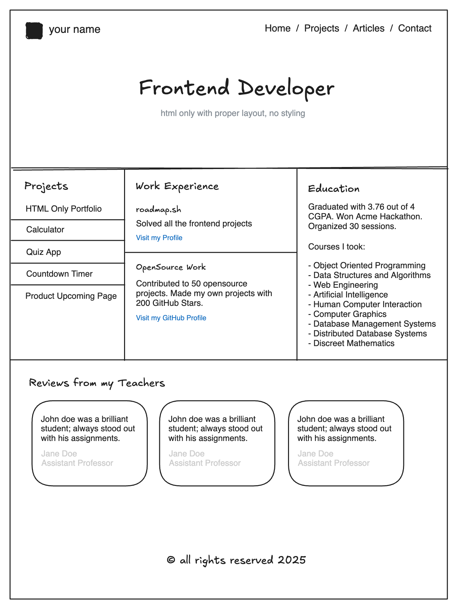

# Front-end Projects from Roadmap.sh

This repository contains front-end projects built following the [roadmap.sh](https://roadmap.sh/) front-end developer path.

## Projects List

### 🟢 Beginner

1. [Single Page CV](https://roadmap.sh/projects/single-page-cv) 
2. [Single Page CV](https://roadmap.sh/projects/single-page-cv)  

Click any of the images below to view the readme and live demo of the project.

  

    <a href="/Beginner/01-single-page-cv/">
      
       
      <strong>Single Page CV</strong>
    </a>
  

  

    <a href="/Beginner/02-basic-HTML-website/">
      
       
      <strong>Basic HTML Website</strong>
    </a>
  

  

